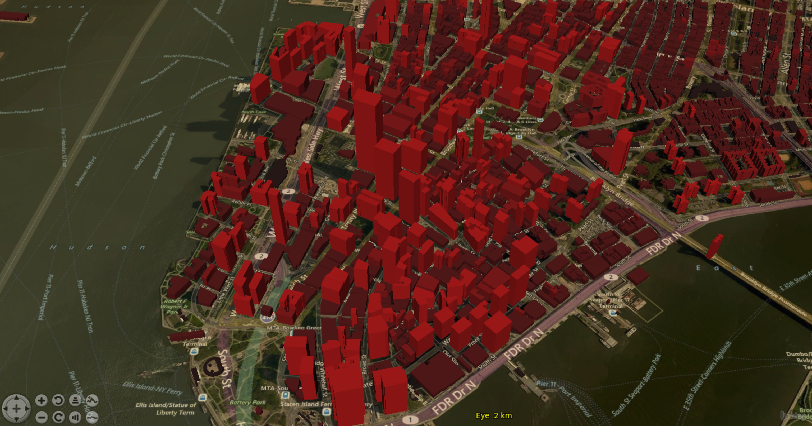

# 2017 GSoC project "3D OSM Plugin API"

The goal of this project is to create a plugin API to display OpenStreetMap (OSM) data on NASA Web World Wind virtual globe in three dimensions. The API fetches the OpenStreetMap (OSM) data in real time based on a bounding box or uses a local OSM GeoJSON file. The project focuses on the performance of the visualization of 3D OSM buildings, and for this purpose creates triangle meshes based on the footprint available in OSM. Height information may come from OSM, a property in GeoJSON file may be used or an arbitrary value may be assigned. The API can also create a heatmap based on the heights of the buildings. The API will also use caching and tiling to improve the performance.

## Milan buildings in 3D, where the height of the buildings is extracted from Lidar using GRASS. A local file is used.

## New York buildings in 3D, where the height information is coming from OSM. The data is fetched in real time.

## Installation instructions for Ubuntu 16.04:

sudo apt-get install apache2

sudo apt-get install git

cd /var/www/html/3dosm

sudo git clone https://github.com/kilsedar/3dosm.git

Visit http://localhost/3dosm/example

### To run the unit tests follow the following steps:

curl -sL https://deb.nodesource.com/setup_6.x | sudo -E bash -

sudo apt-get install nodejs

sudo npm install

sudo npm install -g karma-cli

karma start

### To install JSDoc run the following:

npm install -g jsdoc
